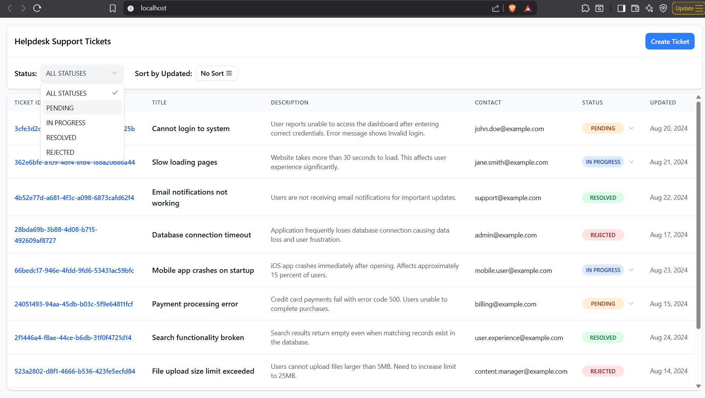

# Helpdesk support ticket Management System

### Prerequisites
Docker and Docker Compose installed on your system

### Quick Start
```bash
docker-compose up -d --build
```

### Access the Application
- **Frontend**: [http://localhost](http://localhost)
- **Swagger UI**: [http://localhost:3000/swagger-ui](http://localhost:3000/swagger-ui)

### Stop the Application
```bash
docker-compose down -v --rmi local
```
## Screenshots
### Dashboard


### Create New Ticket
