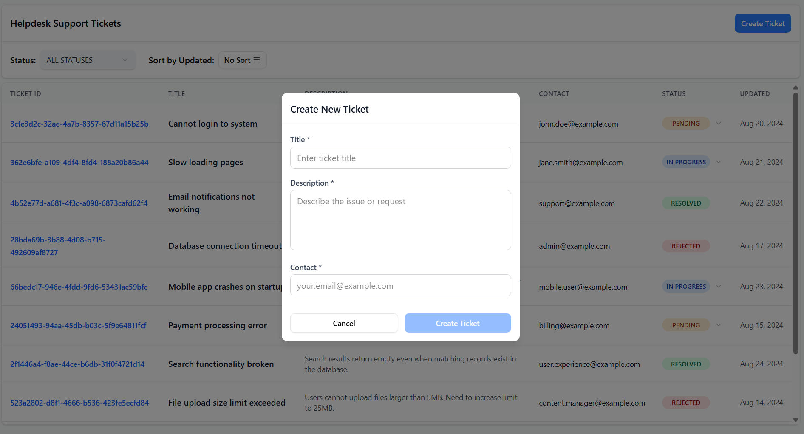

# Helpdesk support ticket Management System

### Prerequisites
Docker and Docker Compose installed on your system

### Quick Start
```bash
docker-compose up -d --build
```
### Stop the Application
```bash
docker-compose down -v --rmi local
```
## Screenshots
### Dashboard


### Create New Ticket
